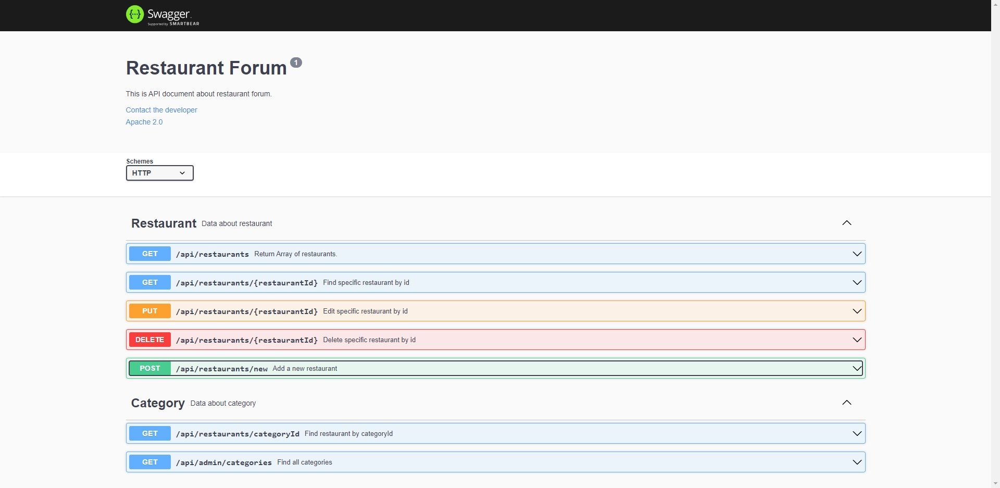

## OpenAPI Built From Swagger

### Basic Structure

The basic structure of the definitions in YAML, and a sample OpenAPI 2.0 definition written in YAML looks like:



### Description

This API document is about restaurant forum.

### Methods

- GET
- POST
- PUT
- DELETE

### Paths

The paths section defines endpoints, and HTTP methods by these endpoints.

For example:

- You can GET all restaurants `(/api/restaurants)` or create a new one `(/api/restaurants/new)`.

### Model

- Restaurant
- NewRestaurant

### Install

1. Store this project to local

```
git clone https://github.com/Coli-co/Express_swagger_restaurant_forum.git
```

2. Switch to folder

```
cd Express_swagger_restaurant_forum
```

3. Install npm packages required

```
npm install
```

4. Test API document

```
nodemon index.js
```

### Creator

**Timothy**

- https://github.com/Coli-co
